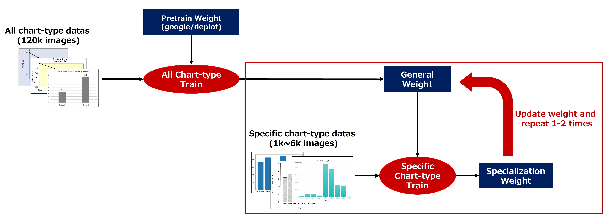

### Links
- Kaggle: https://www.kaggle.com/competitions/benetech-making-graphs-accessible/discussion/418786

### Framework


### Data
1. Competition data set（comp_extracted_dataset / comp_generated_dataset）
    - Using both extracted dataset (comp_extracted_dataset) and generated dataset (comp_generated_dataset). For the generated data, data with noise in the annotations were removed by a simple check (about 100 images). <font color=red>*check competition dataset annotation*</font>

2. ICDAR data set（ICDAR_dataset / ICDAR_manualannot_dataset）
    - I used 1406 pieces of data for which annotations were provided (ICDAR_dataset) and 1903 pieces of data for which no annotations were provided (ICDAR_manualannot_dataset).
    - <font color=red>*check external dataset annotation*</font> For data for which annotations were provided, I visually rechecked the annotation contents and manually corrected all data that did not follow the competition's annotation rules (e.g., % notation) or contained noise.
    - <font color=red>*pseudo label and correction*</font> For the data for which no annotations were provided, I first visually checked the appearance of all the data and selected the data that could be used in this competition. Next, I inferred and assigned pseudo-labels using the Deplot model, visually checked all the results again, and manually corrected all incorrect annotations.
3. Generated synthetic data set（synthetic_dataset）
    - <font color=red>*enhance data variation of original data*</font> Review the competition dataset and find that plots in comp_generated_dataset don't have enough variation to guarantte robustness. so I generated about 65k synthetic data myself.
    - I mainly generated synthetic data with features that comp_generated_dataset does not have.
        - histogram
        - Label contains line breaks
        - Bar chart with error bars
        - Line chart containing x labels not included in the data series

### Pipeline

1. Chart classification
    - <font color=red>Weighted ensemble</font> convnext_large_384 and swin_large_patch4_window12_384
2. Training Configs
    - Dataset:
        - Training(78k images): comp_extracted_dataset, comp_generated_dataset, ICDAR_dataset, synthetic_dataset(horizontal_bar/dot)
        - Validation（4k images）：comp_extracted_dataset, ICDAR_dataset, synthetic_dataset(horizontal_bar/dot)
    - Hyperparameters:
        - epochs:15
        - BatchSize:16
        - Adafactor:lr=3e-5
3. DataSeries Prediction
    - Except for scatter, the predictions are made in Deplot, and scatter is an object detection-based prediction.

    3-a. Bars & Lines & Dots
    - Made some modifications for data format
        - Ground Truth Format: \
        Removed chart type from GroundTruth and adapted the format to that of the Deplot original. <0x0A> is "\n"
        ```
        <0x0A> x_value1 | y_value1 <0x0A> x_value2 | y_value2 <0x0A> x_value3 | y_value3 </s>
        ```
        - x-axis and y-axis swap of horizontal_bar:\
        the concept of x-axis and y-axis was reversed in the annotation rules of this competition and the original format of Deplot, I trained according to the original concept of Deplot and <font color=red>swapped the values during inference</font>.
    - Training: <font color=red> First Stage: </font> All Chart-type Train. <font color=red> Second Stage: </font> Specific Chart-type Train. Use the trained model as initial weights. Generagte chart-specific models.
        - The scores for vertical_bar and line were slightly improved by this method. (Two Specific Chart-type Train runs were performed for vertical_bar and one for line.)
        - **Horizontal_bar** had a worse cv after the second stage of training, **probably due to the small amount of extracted data**, so I decided to _use the All Chart-type Train model to make predictions_.
        - Dot chart only has generated data and I decided that I could not validate it successfully, so I decided not to train after the second stage and use the All Chart-type Train model to make predictions.

    

4. Training Configs

    4-a. All Chart-type Train

    - Dataset
        - Train（120k images）：comp_extracted_dataset, comp_generated_dataset, ICDAR_dataset, synthetic_dataset
        - Validation（2.5k images）：comp_extracted_dataset, ICDAR_dataset, ICDAR_manualannot_dataset
    - Hyperparameters
        - Epochs：8
        - Batch size：2
        - Adafactor (lr=1e-5)
        - cosine scheduler with warmup (warmup_step=4000)
        - Augmentation: GaussianBlur, GaussNoise, some color augmentations
    
    4-b. Specific Chart-type Train  (vertical_bar)
    - Dataset \
    [1st time]
        - Train（6k images） ：comp_extracted_dataset, ICDAR_dataset, synthetic_dataset
        - Validation（1.3k images）：comp_extracted_dataset, ICDAR_dataset, ICDAR_manualannot_dataset
    
    - Dataset \
    [2nd time]
        - Train（1500 images）：comp_extracted_dataset, ICDAR_dataset, ICDAR_manualannot_dataset
        - Validation（500 images） ：comp_extracted_dataset, ICDAR_dataset, ICDAR_manualannot_dataset
    
    - Hyperparameters
        - cosine scheduler with warmup (warmup_step=0)
        - Otherwise, same as All Chart-type Train


    4-c. Specific Chart-type Train (line)

    - Dataset \
    [1st time]

        - Train（1150 images）：comp_extracted_dataset, ICDAR_dataset, ICDAR_manualannot_dataset
        - Validation（400 images）：comp_extracted_dataset, ICDAR_dataset, ICDAR_manualannot_dataset
    - Hyperparameter

        - cosine scheduler with warmup (warmup_step=0)
        - Otherwise, same as All Chart-type Train

    4-d. Scatter Plots
    - Only scatter was not accurate enough with Deplot no matter how I tried, so I adopted an object detection-based approach.

    - Since scatter is guaranteed to have label values of numeric type, it is easy to calculate values from ratios if the "label position," "label text," and "scatter point position" are known. 
        - CACHED detect "label position"
        - Deplot read "label text"
        - YOLOX detect "scatter point"
    - The mapping between label boxes and label texts is a bit crude, but the smallest label text is mapped to the left-most (top in the case of y-labels) label bbox, and the largest label text is mapped to the right-most (bottom in the case of y-labels) label bbox. <font color=red>It is possible that the total number of detected label bboxes does not match the total number of read label texts</font>, but we did not take any special measures because such a pattern was very rare when we checked the verification data.
    - The above object detection approach resulted in a scatter score of Pulic:0.10/Private:0.30, <font color=red> much better than </font> the Deplot-based score (Pulic:0.06/Private:0.13).

    Scatter point detection
    - comp_extracted_dataset, ICDAR_dataset, synthetic_dataset were used for training data (about 12.5k images)
    - To increase detection accuracy, only the plot area was cropped for training and inference.
    - The model was YOLOX-l, input image size was 1280 for both training and inference, and 50 epochs were trained.

    Label text reading
    - comp_extracted_dataset, ICDAR_dataset, comp_generated_dataset were used for training data (about 62k images, all chart types were used, not just scatter)
    - Use the same training configs as in (2-a) All_Chart-type_Train for the training parameters, and change the format of Ground Truth as follows
    ```
    <0x0A> x_label1 | x_label2 | x_label3 <0x0A> y_label1 | y_label2 </s>
    ```
    - At first, I thought of using EasyOCR or similar to achieve this, but there were many issues to be addressed, such as support for character rotation, and it seemed that tuning would be very difficult to increase versatility, so I adopted a method of batch reading with Deplot.