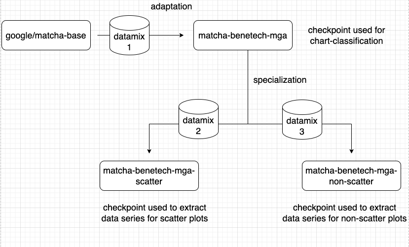
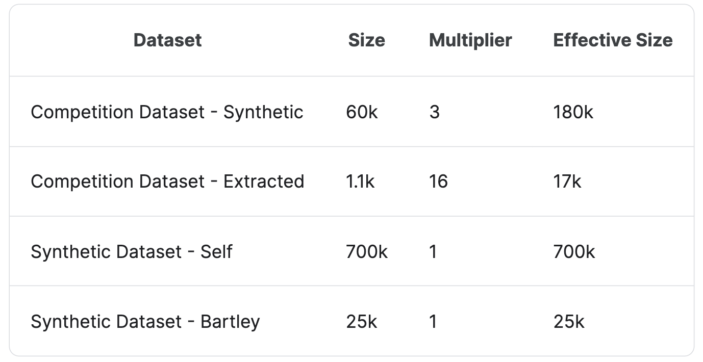
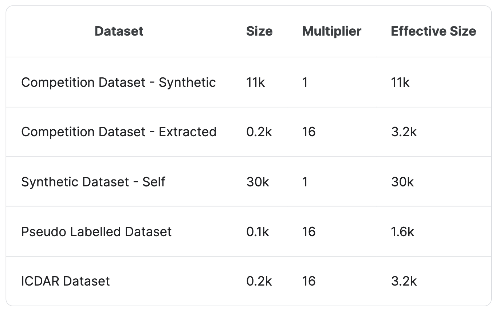
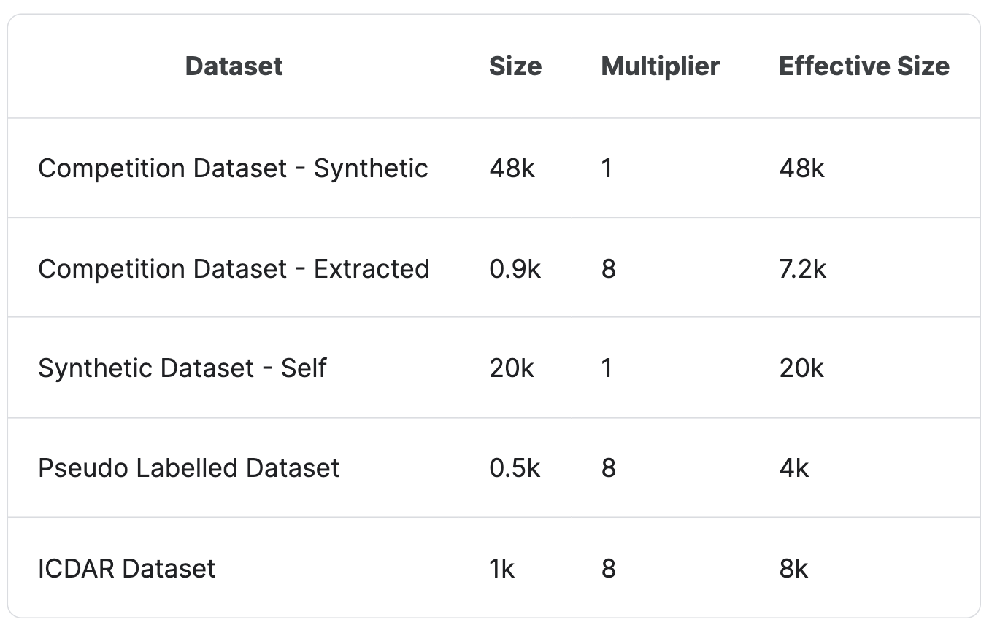

# 主要思想：
只使用visual-language大模型，先通过datamix1进行backbone的domain adaptation，再分别通过两个datamix对另外两个task进行训练

### Links
- Kaggle: https://www.kaggle.com/competitions/benetech-making-graphs-accessible/discussion/418430
- Inference notebook: https://www.kaggle.com/code/conjuring92/a05-mga-split-pipe
- Github Repo: https://github.com/rbiswasfc/benetech-mga

### Framework

### Data
#### Synthetic Dataset
the diverse data is the key for this end-to-end matcha model

#### Synthetic Dataset - Bartley
Random selection of 25k data points from the synthetic dataset shared by @brendanartley: https://www.kaggle.com/datasets/brendanartley/benetech-extra-generated-data

#### Pseudo-labeling
collect plots from https://commons.wikimedia.org/w/index.php?search=line+plots&title=Special:MediaSearch&go=Go&type=image, and use manual correction to generate annotation.

### Data Mix

#### datamix1 for domain adaptation

#### datamix2 for scatter specialization

#### datamix3 for non-scatter specialization
