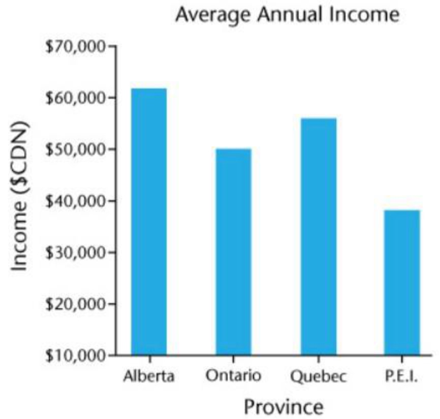
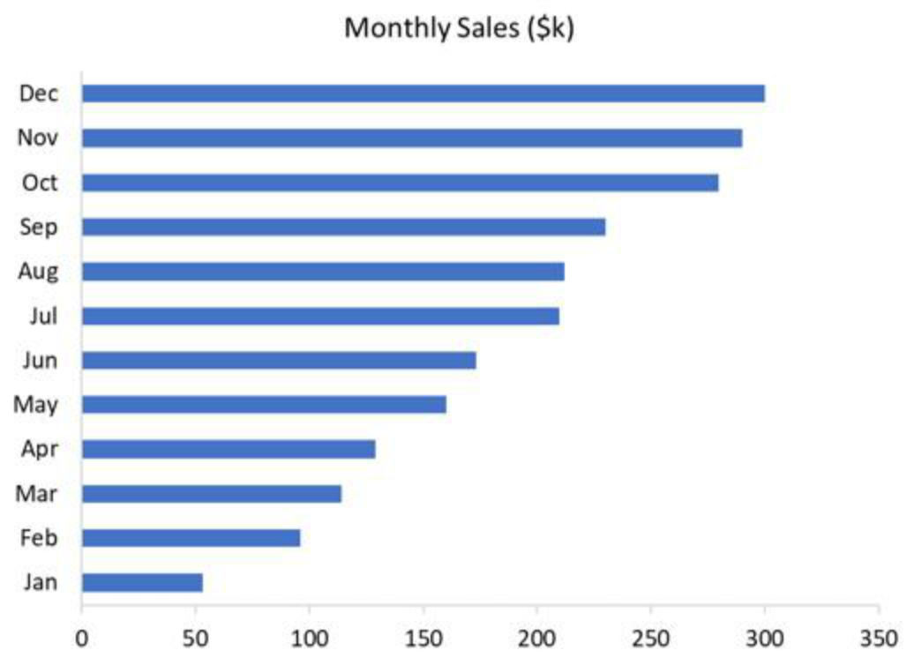
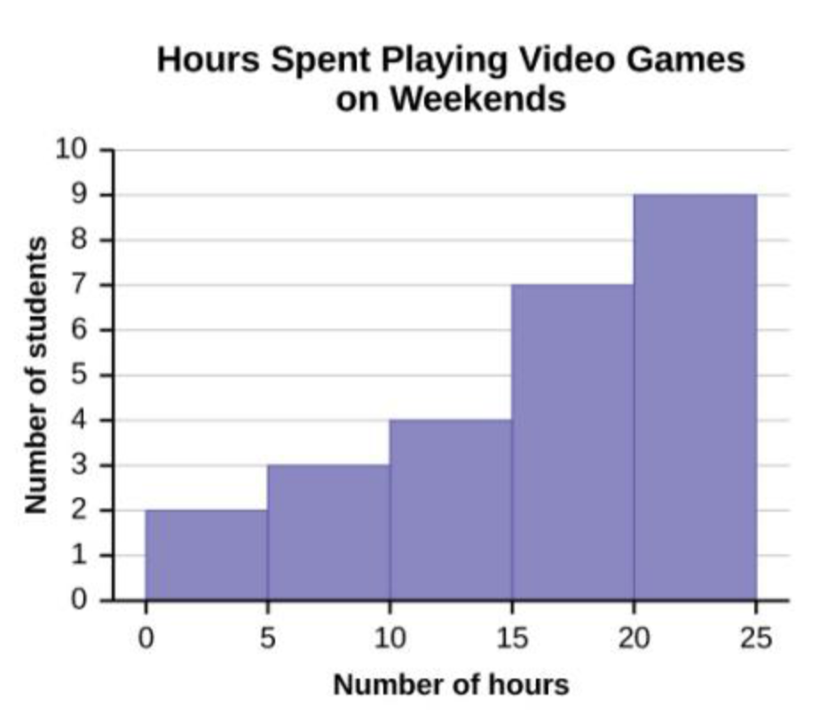
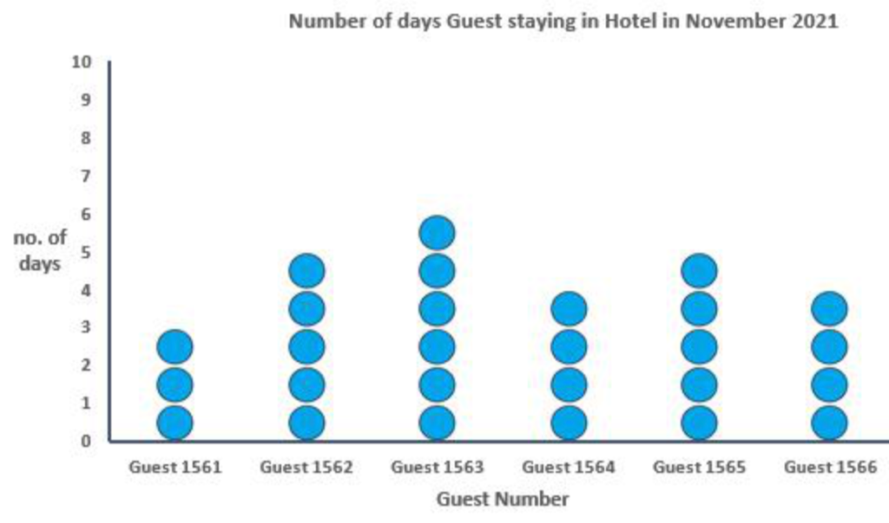
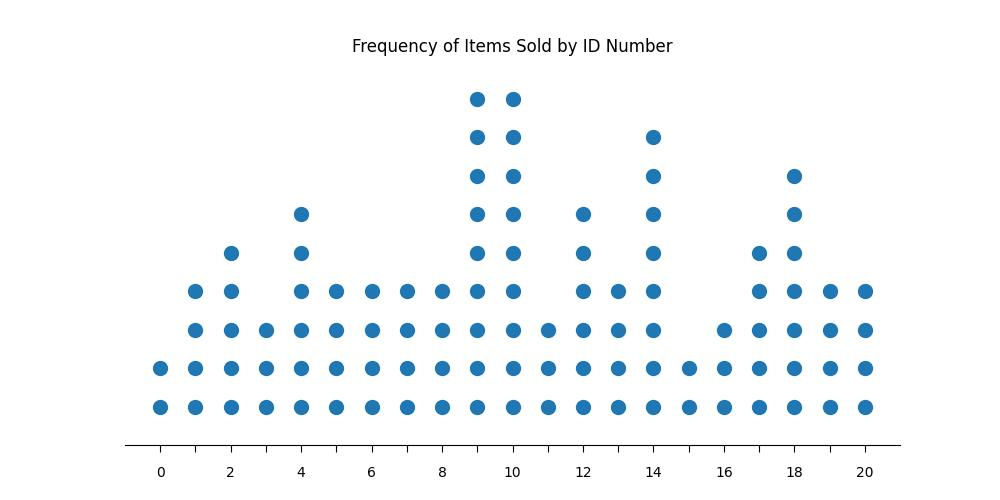
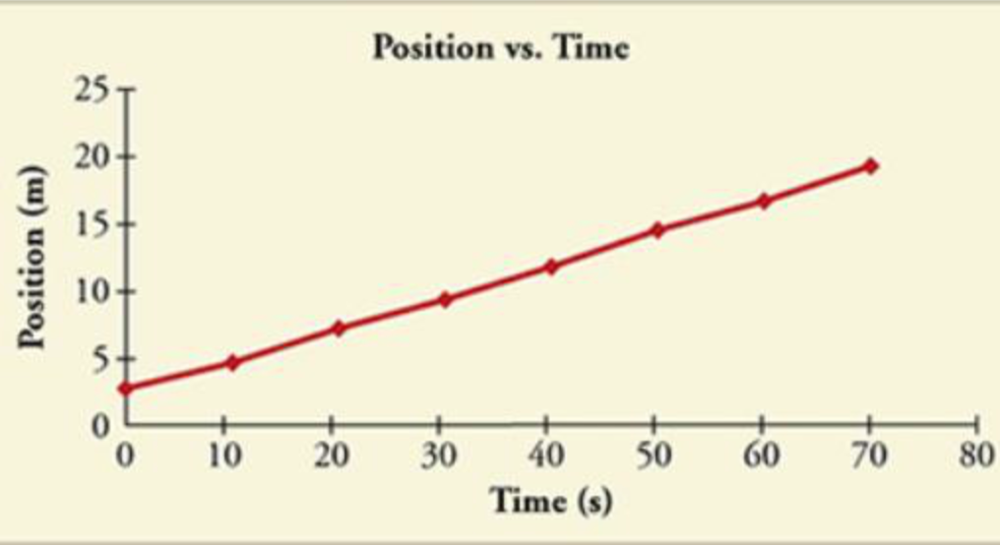
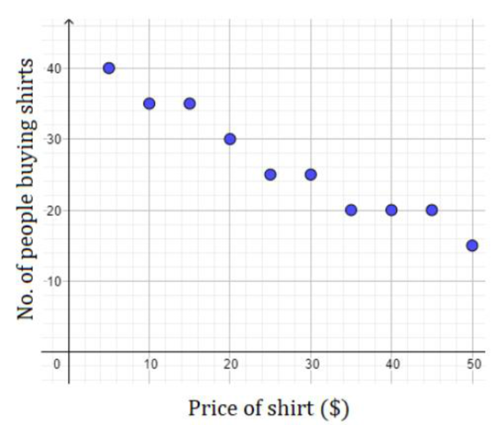

# Competition:

https://www.kaggle.com/competitions/benetech-making-graphs-accessible/overview


### rule of this competition:


 These conventions ensure that predictions can be made in a consistent manner across a variety of chart formats. Be sure to review them carefully.

As a rule:

- Categorical values always correspond to a tick label on an axis.
- Numerical values must be inferred from the tick labels through interpolation.


Vertical Bar:


groud truth:
``` python
x,Alberta;Ontario;Quebec;P.E.I.,vertical_bar
y,62023;50355;56288;38621,vertical_bar
```

Horizontal Bar:


groud truth:
``` python
x,299;289;279;229;211;209;173;159;128;113;95;53,horizontal_bar
y,Dec;Nov;Oct;Sep;Aug;Jul;Jun;May;Apr;Mar;Feb;Jan,horizontal_bar
```

Histogram:
x data series will have one more value than the y data series
Note that for the purposes of scoring, the x-axis values are treated as categorical type, not numeric.


groud truth:
``` python
x,0;5;10;15;20;25,vertical_bar
y,2.0;3.0;4.0;7.0;9.0,vertical_bar
```

Dot:

The x-axis values will be numeric if the tick labels can be parsed as Python floats; otherwise, they are categorical:

Categorical X-Axis:


groud truth:
``` python
x,Guest 1561;Guest 1562;Guest 1563;Guest 1564;Guest 1565;Guest 1566,dot
y,3;5;6;4;5;4,dot
```


Numeric X-Axis:


groud truth:
``` python
x,0;1;2;3;4;5;6;7;8;9;10;11;12;13;14;15;16;17;18;19;20,dot
y,2;4;5;3;6;4;4;4;4;9;9;3;6;4;8;2;3;5;7;4;4,dot
```


Line:

Line graphs always have categorical x-axis values and numeric y-axis values

groud truth:
``` python
x,0;10;20;30;40;50;60;70,line
y,2.85532;4.85973;7.02666;9.41515;11.72693;14.44788;16.70328;19.50852,line
```

Scatter:


groud truth:
``` python
x,0;10;20;30;40;50;60;70,line
y,2.85532;4.85973;7.02666;9.41515;11.72693;14.44788;16.70328;19.50852,line
```