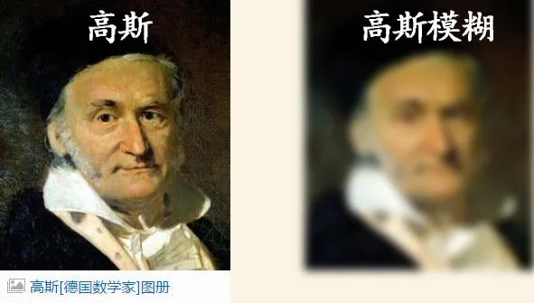
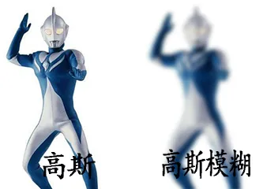
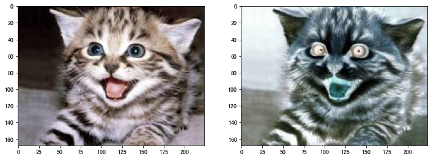
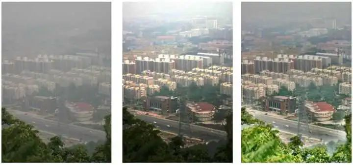

# 1st solution

classification phase:

```
 A.Compose(
        [
            A.GaussianBlur(p=0.5),
            A.GaussNoise(p=0.5),            
            A.OneOf([
                A.HueSaturationValue(p=1),
                A.RGBShift(p=1),
                A.ChannelShuffle(p=0.8),
                A.ToGray(p=0.8),
            ],p=0.5),
            A.OneOf([
                A.InvertImg(p=1),
                A.RandomBrightnessContrast(brightness_limit=(-0.05, 0.1), p=1),
                A.CLAHE(p=1),
            ],p=0.1),
            A.Normalize(p=1),
        ], 
        p=1.0, 
    )
```

1. GussianBlur/Noise




<font size=5, color=red>A.OneOf([</font>

2.HueSaturationValue
随机改变输入图像的色调、饱和度和数值。


3.RGBShift
对输入的RGB图像的每个通道进行随机移值


4.ChannelShuffle
随机地重新排列输入的RGB图像的通道


5.ToGray
转成灰度


<font size=5, color=red>])</font>


<font size=5, color=red>A.OneOf([</font>

6.InvertImg
通过从255减去像素值来反转输入图像



7.RandomBrightnessContrast(brightness_limit=(-0.05, 0.1), p=1),
随机改变输入图像的亮度和对比度


8.CLAHE
【Contrast Stretching】:对比度拉伸；
【HE】:直方图均衡；
【CLHE】:对比度限制的HE
【AHE】：自适应直方图均衡化
https://cloud.tencent.com/developer/article/1667213

CLAHE起到的作用简单来说就是增强图像的对比度的同时可以抑制噪声

<font size=5, color=red>])</font>

9.Normalize


# 2st solution

```
transforms = A.Compose(
        [
            A.OneOf(
                [
                    A.RandomToneCurve(scale=0.3),
                    A.RandomBrightnessContrast(
                        brightness_limit=(-0.1, 0.2),
                        contrast_limit=(-0.4, 0.5),
                        brightness_by_max=True,
                    ),
                    A.HueSaturationValue(
                        hue_shift_limit=(-20, 20),
                        sat_shift_limit=(-30, 30),
                        val_shift_limit=(-20, 20)
                    )
                ],
                p=0.5,
            ),

            A.OneOf(
                [
                    A.MotionBlur(blur_limit=3),
                    A.MedianBlur(blur_limit=3),
                    A.GaussianBlur(blur_limit=3),
                    A.GaussNoise(var_limit=(3.0, 9.0)),
                ],
                p=0.5,
            ),

            A.Downscale(always_apply=False, p=0.1, scale_min=0.90, scale_max=0.99),
        ],

        p=0.5,
    )
```

# 3st solution

```python

import albumentations as albu
from albumentations.pytorch import ToTensorV2


def blur_transforms(p=0.5, blur_limit=5):
    """
    Applies MotionBlur or GaussianBlur random with a probability p.

    Args:
        p (float, optional): probability. Defaults to 0.5.
        blur_limit (int, optional): Blur intensity limit. Defaults to 5.
    Returns:
        albumentation transforms: transforms.
    """
    return albu.OneOf(
        [
            albu.MotionBlur(always_apply=True),
            albu.GaussianBlur(always_apply=True),
        ],
        p=p,
    )


def color_transforms(p=0.5):
    """
    Applies RandomGamma or RandomBrightnessContrast random with a probability p.

    Args:
        p (float, optional): probability. Defaults to 0.5.
    Returns:
        albumentation transforms: transforms.
    """
    return albu.OneOf(
        [
            albu.RandomGamma(gamma_limit=(50, 150), always_apply=True),
            albu.RandomBrightnessContrast(
                brightness_limit=0.1, contrast_limit=0.2, always_apply=True
            ),
            albu.ChannelShuffle(always_apply=True),
            albu.ToGray(always_apply=True),
        ],
        p=p,
    )


def get_transfos(augment=True, resize=(256, 256), mean=0, std=1, strength=1):
    """
    Returns transformations for image augmentation.

    Args:
        augment (bool, optional): Whether to apply augmentations. Defaults to True.
        resize (tuple, optional): Resize dimensions (height, width) of the images. Defaults to (256, 256).
        mean (np array, optional): Mean for normalization. Defaults to 0.
        std (np array, optional): Standard deviation for normalization. Defaults to 1.
        strength (int, optional): Strength level for augmentations. Defaults to 1.

    Returns:
        albumentation transforms: Transforms for image augmentation.
    """
    resize_aug = [
        albu.Resize(resize[0], resize[1])
    ] if resize else []

    normalizer = albu.Compose(
        resize_aug
        + [
            ToTensorV2(),
        ],
        p=1,
    )

    if augment:
        if strength == 0:
            augs = [
                # albu.HorizontalFlip(p=0.5),
            ]
        elif strength == 1:
            augs = [
                albu.HorizontalFlip(p=0.5),
                albu.ShiftScaleRotate(
                    scale_limit=0.1,
                    shift_limit=0.0,
                    rotate_limit=20,
                    p=0.5,
                ),
                color_transforms(p=0.5),
            ]
        elif strength == 2:
            augs = [
                albu.HorizontalFlip(p=0.5),
                albu.ShiftScaleRotate(
                    scale_limit=0.2,
                    shift_limit=0.2,
                    rotate_limit=30,
                    p=0.75,
                ),
                color_transforms(p=0.5),
                blur_transforms(p=0.25),
            ]
        elif strength == 3:
            augs = [
                albu.HorizontalFlip(p=0.5),
                albu.ShiftScaleRotate(
                    scale_limit=0.2,
                    shift_limit=0.2,
                    rotate_limit=5,
                    p=1.,
                ),
                color_transforms(p=1.),
                blur_transforms(p=0.25),
            ]
    else:
        augs = []

    return albu.Compose(augs + [normalizer])
```


# 4st solution